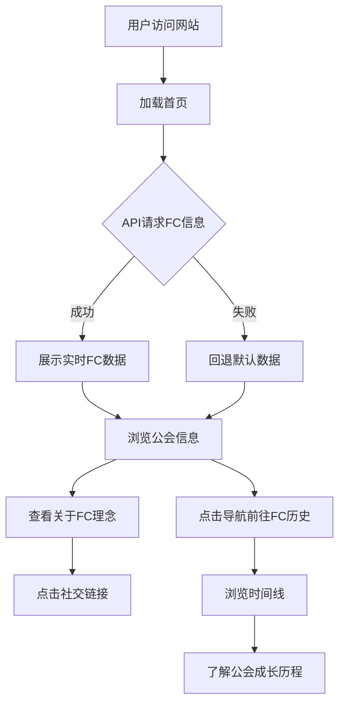

# 神無月 (Kanazuki) — 游戏公会主页 PRD

## 1. 产品概述

神無月 (Kanazuki) 是 Final Fantasy XIV (FF14) 游戏中的自由公司 (Free Company) 与跨服通讯贝 (CWLS) 的主页。网站旨在展示公会信息、历史沿革、活跃氛围，吸引志同道合的冒险者加入。

- **目标用户**：FF14 国服玩家，寻找归属感的萌新与回归者
- **核心价值**：以沉浸式的视觉体验传达公会"共同运营、共享快乐、相互尊重"的理念，展示公会活跃数据与成长历程

## 2. 核心功能

### 2.1 功能模块

1. **首页**：Hero 主视觉、关于FC理念展示、FC信息卡片（API实时数据）、社交链接
2. **FC历史页**：时间线展示公会从创立至今的重要里程碑

### 2.2 页面详情

| 页面名称 | 模块名称 | 功能描述 |
|---------|---------|---------|
| 首页 | Hero 主视觉 | 全屏暗色星空背景，公会Logo淡入展示，标题"Freecompany and Cross-world Linkshell"，滚动指示器 |
| 首页 | 关于FC | 三张卡片展示公会理念：共同运营 / 共享快乐 / 相互尊重，带图标与中日双语描述 |
| 首页 | FC信息卡片 | 从API获取实时数据（部队名、标签、服务器、活跃时间、成员数、等级等），加载时显示骨架屏，失败时回退默认数据 |
| 首页 | 社交链接 | Lodestone、Discord、GitHub 等外链按钮，悬停动画 |
| 首页 | 页脚 | 版权声明 (SQUARE ENIX / Crystal Alliance) |
| FC历史页 | 时间线 | 左右交替的时间线布局，展示公会重要事件：创立、购房、改名等里程碑 |

### 2.3 趣味交互

- **点击文字特效**：点击页面任意位置时，随机弹出FF14星极/灵极相关词汇（Astral, Umbral, Arcanum 等），向上飘动并渐隐
- **标签页标题动画**：切换浏览器标签页时，标题变为趣味文字，回到页面时恢复

## 3. 核心流程

## 4. 用户界面设计

### 4.1 设计风格

- **主题**：暗色幻象风格 (Dark Ethereal Fantasy)，呼应FF14星极/灵极世界观与公会名"神無月/虚妄"
- **主色调**：深邃午夜蓝黑 (#0a0a1a) 为背景，水晶蓝 (#6592e6) 为主强调色，以太紫 (#9d7fd4) 为次强调色
- **点缀色**：金色 (#e6c06b) 用于大国防联军等关键信息
- **按钮风格**：半透明玻璃拟态 (glassmorphism)，带发光边框，悬停时光晕扩散
- **字体**：标题使用 Cinzel (古典衬线体，呼应奇幻世界感)，中文使用 Noto Serif SC，正文使用 Noto Sans SC / Noto Sans JP
- **布局**：全屏沉浸式 Hero，卡片式内容区，时间线左右交替布局
- **动效**：星空粒子背景、Logo淡入、滚动渐显、悬停光晕、点击文字飘散

### 4.2 页面设计概览

| 页面名称 | 模块名称 | UI元素 |
|---------|---------|--------|
| 首页 | Hero | 全屏暗色星空背景 + 粒子动效，居中Logo淡入，白色副标题，底部滚动指示器动画 |
| 首页 | 关于FC | 三列玻璃卡片，每张含图标 + 中文标题 + 日文副标题，悬停上浮发光 |
| 首页 | FC信息卡片 | 玻璃拟态卡片，左侧信息列表（图标+标签+值），右侧部队图片，底部标签云，加载骨架屏 |
| 首页 | 社交链接 | 圆形图标按钮排列，悬停旋转放大 + 平台色光晕 |
| 首页 | 页脚 | 暗色背景，居中版权文字 |
| FC历史 | 时间线 | 中央竖线 + 左右交替节点，每个节点含日期、标题、描述，滚动时逐个渐入 |

### 4.3 响应式

- 桌面优先设计，平板/手机自适应
- 移动端：导航折叠为汉堡菜单，FC卡片上下堆叠，时间线改为单侧布局，社交链接居中排列
- 触摸优化：按钮/卡片最小点击区域 44px

## 5. 技术约束

- 前端单页应用 (SPA)，React + Vite + TailwindCSS
- FC信息数据来源：`https://phantoms-backend.onrender.com/api/risingstones/guild-info`，失败时回退硬编码默认数据
- 保留原有图片资源（Logo等）
- 部署为静态站点，兼容 Cloudflare Pages
