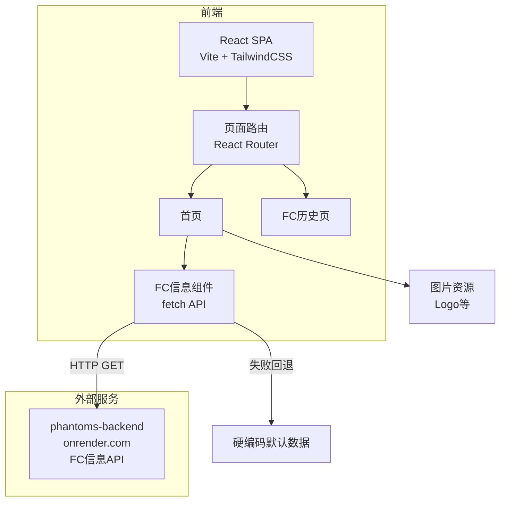

# 神無月 (Kanazuki) — 技术架构文档

## 1. 架构设计



## 2. 技术说明

- **前端框架**：React@18 + tailwindcss@3 + vite
- **初始化工具**：vite-init (react-ts 模板)
- **路由**：react-router-dom@6
- **动画**：framer-motion (Motion 库) — 页面过渡、滚动渐显、悬停动效
- **后端**：无（纯前端，FC数据来自外部API）
- **部署**：静态构建产物，兼容 Cloudflare Pages

## 3. 路由定义

| 路由 | 用途 |
|------|------|
| `/` | 首页：Hero + 关于FC + FC卡片 + 社交链接 |
| `/history` | FC历史时间线页面 |

## 4. 组件结构

```
src/
├── App.tsx                    # 根组件，路由配置
├── main.tsx                   # 入口
├── index.css                  # 全局样式 + Tailwind
├── components/
│   ├── Layout/
│   │   ├── Navbar.tsx         # 导航栏（固定顶部，玻璃拟态）
│   │   └── Footer.tsx         # 页脚
│   ├── home/
│   │   ├── Hero.tsx           # 全屏Hero主视觉
│   │   ├── StarfieldBackground.tsx  # 星空粒子背景（Canvas）
│   │   ├── AboutFC.tsx        # 关于FC理念卡片
│   │   ├── FCCard.tsx         # FC信息卡片（API集成）
│   │   └── SocialLinks.tsx    # 社交链接
│   ├── history/
│   │   └── Timeline.tsx       # FC历史时间线
│   └── effects/
│       ├── ClickTextEffect.tsx  # 点击文字飘散特效
│       └── TitleAnimation.tsx    # 标签页标题切换动画
├── hooks/
│   └── useGuildInfo.ts        # FC信息数据获取hook
├── data/
│   ├── guildInfo.ts           # 默认FC数据
│   ├── historyData.ts         # 历史时间线数据
│   └── socialLinks.ts         # 社交链接配置
└── assets/                    # 图片资源（从原项目迁移）
```

## 5. API 定义

### FC信息接口

**请求**：`GET https://phantoms-backend.onrender.com/api/risingstones/guild-info`

**响应** (TypeScript 类型)：

```typescript
interface GuildInfoResponse {
  code: number;        // 10000 表示成功
  msg: string;
  data: GuildInfo;
}

interface GuildInfo {
  guild_name: string;           // 部队名 "Phantom"
  guild_tag: string;            // 标签 "虚妄"
  area_name: string;            // 大区 "莫古力"
  group_name: string;           // 服务器 "拂晓之间"
  active_time_weekday: string;  // 工作日活跃 "01:00-24:00"
  active_time_weekend: string;   // 周末活跃 "01:00-24:00"
  create_time: string;          // 成立时间 "2020-08-17 22:37:01"
  active_member_num: number;    // 活跃成员数
  member_num: number;            // 总成员数
  guild_rank: string;           // 部队等级
  grand_parentname: string;      // 大国防联军
  guild_pic: string;             // 部队图片URL
  guild_label: string[];         // 标签数组
}
```

### 数据获取策略

```typescript
// useGuildInfo.ts
function useGuildInfo(): {
  data: GuildInfo | null;
  loading: boolean;
  error: boolean;
  retry: () => void;
}
```

- 首次加载调用API，超时10秒后视为失败
- 失败时使用硬编码默认数据，不报错
- 提供retry方法供用户手动重试

## 6. 样式架构

### 设计令牌 (CSS Variables)

```css
:root {
  --bg-primary: #0a0a1a;       /* 深邃午夜蓝黑 */
  --bg-secondary: #0d0d1f;     /* 次级背景 */
  --bg-card: rgba(20, 20, 40, 0.6);  /* 卡片背景（半透明） */
  --accent-primary: #6592e6;   /* 水晶蓝 */
  --accent-secondary: #9d7fd4; /* 以太紫 */
  --accent-gold: #e6c06b;      /* 金色 */
  --text-primary: #f0f0f5;     /* 主文字 */
  --text-secondary: #a0a0b8;   /* 次级文字 */
  --border-glow: rgba(101, 146, 230, 0.3);  /* 发光边框 */
}
```

### TailwindCSS 配置

- 扩展自定义颜色为 Tailwind 主题色
- 自定义字体族 (font-display, font-body, font-jp)
- 自定义动画 keyframes (float, glow, fadeIn, slideUp)
